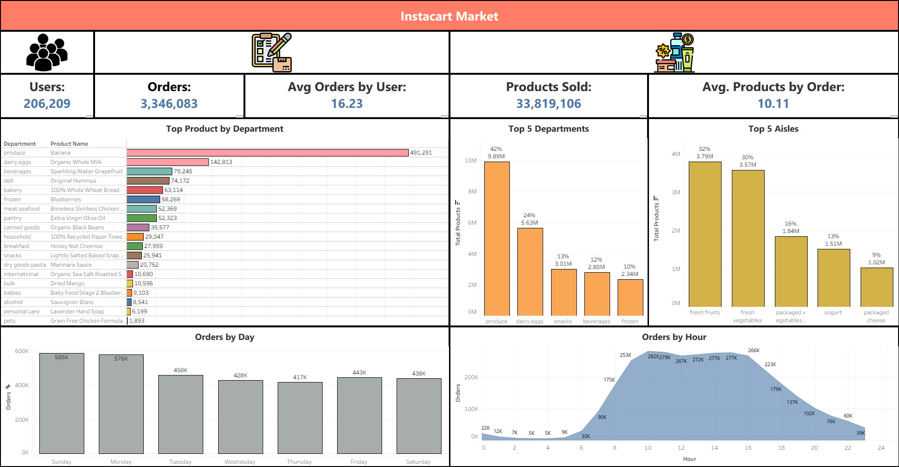
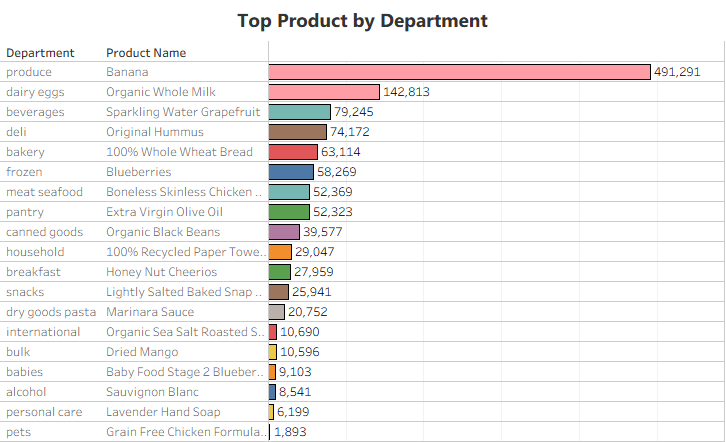
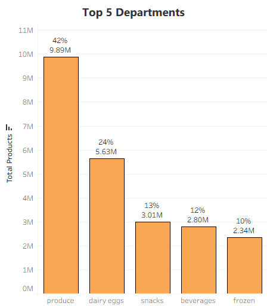
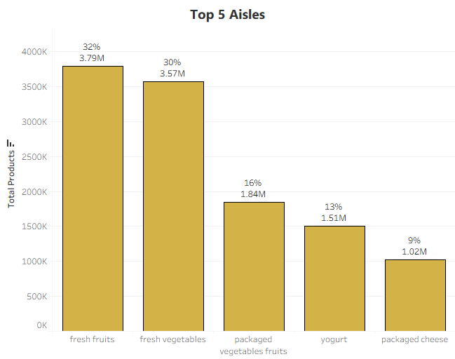
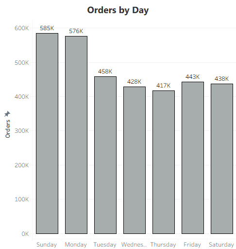
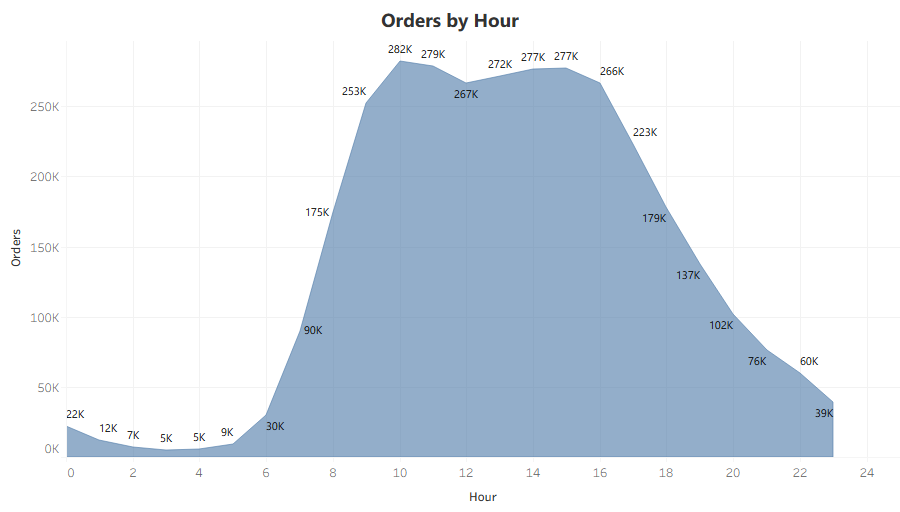

# Instacart Market Analysis
End-to-end ETL pipeline built on AWS to analyze Instacart customer purchasing behavior.


## Table of Contents
- [Project Highlights](#project-highlights)
- [Project Overview](#project-overview)
- [Objective](#objective)
- [Dataset Source](#dataset-source)
- [Dataset](#dataset)
- [Project Structure](#project-structure)
- [Tech Stack](#tech-stack)
- [Project Architecture](#project-architecture)
- [Architecture Diagram](#architecture-diagram)
- [Data Preprocessing](#data-preprocessing)
- [Data Quality Validation](#data-quality-validation)
- [How to Run](#how-to-run)
- [Example SQL Query](#example-sql-query)
- [Dashboard](#dashboard)
- [Key Insights](#key-insights)
- [Business Impact](#business-impact)
- [Assumptions and Limitations](#assumptions-and-limitations)
- [Future Improvements](#future-improvements)

## Project Highlights

- Built an end-to-end ETL pipeline on AWS to process Instacart order data.
- Transformed raw CSV datasets into optimized Parquet files for analytical workloads.
- Implemented data validation checks to ensure dataset consistency.
- Queried the processed data using Amazon Athena and DuckDB.
- Built an interactive Tableau dashboard to analyze customer purchasing behavior.

## Project Overview

This project implements a complete ETL pipeline using the Instacart orders dataset.

The pipeline extracts five raw data files, performs data cleaning, joins the datasets into a unified analytical layer, applies feature engineering, and stores the curated output in Parquet format for analytical queries.

## Objective

The goal of this project is to demonstrate core data engineering practices, including:

- Data cleaning
- Feature engineering
- Columnar storage using Parquet
- SQL analytics with DuckDB and Amazon Athena
- Data visualization using Tableau

## Dataset Source

This project uses the **Instacart Online Grocery Shopping Dataset 2017**, a public dataset commonly used for analytics and data engineering projects.

- **Source:** [Kaggle - Instacart Market Basket Analysis](https://www.kaggle.com/datasets/psparks/instacart-market-basket-analysis/data)
- **Usage:** Educational and portfolio purposes only

> **Note:** This dataset is a sample of historical Instacart orders and does not represent full production data.

## Dataset
The dataset contains information about customer orders and products. 

Key features include:

- *order_id* – Unique order ID
- *user_id* – Unique user ID
- *eval_set* - Indicates the dataset split the order belongs to (prior or train)
- *order_number* - Sequential order number for each user
- *order_dow* - Day of the week when the order was placed (0 = Sunday, 6 = Saturday)
- *order_hour_of_day* - Hour of the day when the order was placed
- *days_since_prior_order* - Number of days since the user's previous order
- *product_name* – Product Name 
- *product_id* - Unique product ID
- *aisle_id* - Unique aisle ID
- *aisle* - Name of the aisle
- *department_id* - Unique department ID
- *department* - Name of the department
- *add_to_cart_order* - Order in which the product was added to cart
- *reordered* - Indicates whether the product was previously purchased by the user (1 = yes, 0 = no)

**Note:** These datasets will be joined in later steps to create a unified dataset for analysis.

## Project Structure

```
instacart_market_etl
│
├── data/
│ ├── raw/
│ │    ├── aisles/
│ │    ├── departments/
│ │    ├── order_products/
│ │    ├── orders/
│ │    └── products/
│ │
│ ├── processed/
│ │    ├── aisles/
│ │    ├── departments/
│ │    ├── order_products/
│ │    ├── orders/
│ │    └── products/
│ │
│ └── cleaned/
│
├── notebooks/
├── glue_jobs/
├── athena/
└── screenshots/
```

## Tech Stack
- **Python** – Data processing and pipeline scripting
- **Amazon S3** – Scalable cloud data storage
- **AWS Glue** – ETL data transformation
- **Amazon Athena** – Serverless SQL query engine
- **DuckDB** – Local analytical SQL engine
- **Pandas / NumPy** – Data manipulation
- **Matplotlib / Seaborn** – Exploratory data analysis (EDA)
- **Tableau** – Data visualization and dashboarding
- **Parquet** – Columnar storage format optimized for analytics

## Project Architecture

Extract → Transform → Load

Raw CSV → Data Cleaning → Feature Engineering → Parquet Storage → SQL Analytics → Visualization Dashboard


## Architecture Diagram
        Raw Data (CSV Files)
               │
               ▼
        Amazon S3 (Storage)
               │
               ▼
        AWS Glue Jobs
    (Data Cleaning + Feature Engineering)
               │
               ▼
        Amazon S3 (Parquet)
               │
               ▼
        Athena / DuckDB
               │
               ▼
        Tableau Dashboard


## Data Preprocessing
Steps performed in the project:

1. Standardized schemas across raw CSV files.
2. Selected analytical columns relevant for customer and product behavior analysis.
3. Cleaned inconsistent or missing values in key fields.
4. Joined orders, products, aisles, departments, and order-product tables into a unified analytical dataset.
5. Validated referential integrity across primary and foreign keys.
6. Exported curated outputs in Parquet format for query performance optimization.

## Data Quality Validation

During the transformation stage, several validation checks were applied:

- Ensured that critical fields do not contain null values.
- Validated data types for selected fields.
- Verified that each *product_id* maps to a single *product_name*.
- Confirmed that each *product_id* is associated with only one value for *product_name*, *department*, and *aisle*.
- Ensured that the same product does not appear more than once within a single order.
- Verified that every order contains at least one product.

## How to Run
1. Download the Instacart dataset from Kaggle.
2. Upload the raw CSV files to the corresponding folders in your Amazon S3 bucket.
3. Run the AWS Glue jobs to clean and preprocess the datasets.
4. Join the processed tables into a unified analytical dataset.
5. Store the final output in Parquet format.
6. Query the curated dataset using Amazon Athena or DuckDB.
7. Connect the final dataset to Tableau to build the dashboard.

## Example SQL Query
Using Amazon Athena;
Total amount of orders by department.
```sql
SELECT 
    department, 
    COUNT(DISTINCT order_id) as total_orders
from instacart_cleaned
GROUP BY department
ORDER BY total_orders DESC;
```

## Dashboard



| KPI Cards | Product by Department |
|-----------|----------------------|
|  |  |

| Top Departments | Top Aisles |
|----------------|------------|
|  |  |

| Orders by Day | Orders by Hour |
|---------------|---------------|
|  |  |


## Key Insights

- Customers purchase an average of 10 products per order, indicating relatively large basket sizes.
- Bananas and Organic Whole Milk are the best-selling products across the dataset.
- Among the top five departments, the *Produce* department dominates sales, representing 42% of total products sold.
- The top three aisles are mainly related to fresh fruits and vegetables, highlighting strong demand for fresh products.
- Sunday and Monday show the highest number of orders, suggesting that many users shop at the beginning of the week.
- The highest shopping activity occurs during daytime hours, between 9:00 AM and 4:59 PM.


## Business Impact

- **Operational planning:** Since most orders occur during daytime hours, grocery delivery services and warehouse operations can allocate more staff during these peak periods.
- **Inventory optimization:** Produce dominates product sales, followed by Dairy & Eggs. Retailers should prioritize stock availability in these departments to avoid shortages.
- **Marketing strategy**: Promotions and targeted campaigns could be scheduled earlier in the week, as Sunday and Monday show the highest order volumes.
- **Category management:** High-performing aisles such as fruits and vegetables indicate strong demand for fresh products, suggesting opportunities for expanding these product categories.

## Assumptions and Limitations

- This dataset is a public sample and does not represent full Instacart production data.
- The analysis is based on historical order behavior and should be interpreted as exploratory.
- The project focuses on batch ETL and analytical reporting rather than real-time processing.
- Business insights are inferred from order frequency and product occurrence data, not from revenue or profit metrics.

## Future Improvements

- Automate pipeline orchestration with AWS Step Functions or EventBridge
- Add data partitioning strategies to improve Athena query performance
- Integrate data quality monitoring tools
- Deploy dashboards with scheduled refresh workflows
