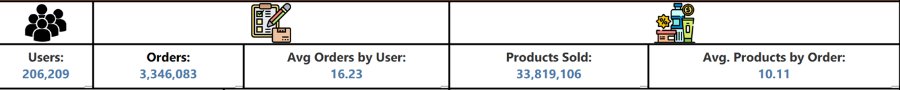

# Instacart Market Dashboard

This dashboard was built using Tableau to analyze consumers purchasing actions, including products, departments, datetime and typical shopping characteristics.

## Full Dashboard

## Dashboard Objective

- The goal of this dashboard is to analyze consumer purchasing behavior, identifying the most attractive products, departments, and typical shopping characteristics.

## Business Questions

This dashboard aims to answer the following business questions:

- Which departments generate the highest number of product sales?
- What are the most popular products within each department?
- Which aisles attract the highest consumer demand?
- On which days of the week do customers place the most orders?
- At what time of the day does shopping activity peak?
- What is the typical basket size for each order?

## Dataset

The dataset contains information about customer orders and products. Key features include:

- *order_id* – Unique order ID
- *user_id* – Unique user ID
- *eval_set* - Indicates the dataset split the order belongs to (prior or train)
- *order_number* - Sequential order number for each user
- *order_dow* - Day of the week when the order was placed (0 = Sunday, 6 = Saturday)
- *order_hour_of_day* - Hour of the day where the order was placed
- *days_since_prior_order* - Number of days since the user's previous order
- *product_name* – Product Name 
- *product_id* - Unique product ID
- *aisle_id* - Unique aisle ID
- *aisle* - Name of the aisle
- *department_id* - Unique department ID
- *department* - Name of the department
- *add_to_cart_order* - Order in which the product was added to cart
- *reordered* - Indicates whether the product was previously purchased by the user (1 = yes, 0 = no)

## Tech Stack

- Python 
- Amazon S3 - Data Storage
- Pandas / NumPy – Data manipulation
- AWS Glue – Data cleaning and preprocessing    
- Amazon Athena / DuckDB - SQL Analytics
- Matplotlib / Seaborn – Exploratory Data Analysis (EDA)
- Tableau - Data visualization and dashboard

## Project Architecture

Extract → Transform → Load

Raw CSV → Data Cleaning → Feature Engineering → Parquet Storage → SQL Analytics → Visualization Dashboard

## Metrics

- *weekday* - Day of the week
- *users* - Total unique users
- *orders* - Total unique orders
- *total_products* - Total Products
- *ranking* - Ranks a calculated field
- *avg_product_by_order* - Average products by order
- *avg_orders_by_user* - Average orders by unique user

## Visualizations

The dashboard includes the following visualizations:

- KPI cards summarizing total users, orders, products sold, average orders per user, and average products per order. 
- Top Product by Department showing the best-selling product within each department.
- Top 5 Departments ranked by total products sold.
- Top 5 Aisles ranked by total products sold.
- Orders by Day showing purchasing behavior across the week
- Orders by Hour highlighting peak shopping hours during the day.

## Filters

- KPI Cards: Each KPI card uses its own calculation filter to display the corresponding aggregated metric.
- Top Product by Department: A ranking filter is used to show the best-selling product within each department.
- Top Departments and Aisles: Filters are applied to display only the top five results based on the number of products sold.

## Key Insights

- Customers purchases an average of 10 products per order, indicating relatively large basket sizes.
- Bananas and Organic Whole Milk are the best-selling products across the datset.
- Among the top five departments, the *Produce* department dominates sales, representing 42% of total products sold.
- The top three aisles are mainly related to fresh fruits and vegetables, highlighting strong demand for fresh products.
- Sunday and Monday show the highest number of orders, suggesting that many users shop at the beginning of the week.
- The highest shopping activity occurs during daytime hours, between 9:00 AM and 4:59 PM.

## Dashboard Highlights

Key analytical components included in the dashboard:

- KPI cards summarizing platform activity and consumer purchasing patterns.
- Category-level analysis through departments and aisles.
- Product-level insights showing best-selling items.
- Temporal analysis of purchasing behavior by day and hour.

## Dashboard Content

| KPI Cards | Product by Department |
|-----------|----------------------|
|  |  |

| Top Departments | Top Aisles |
|----------------|------------|
|  |  |

| Orders by Day | Orders by Hour |
|---------------|---------------|
|  |  |